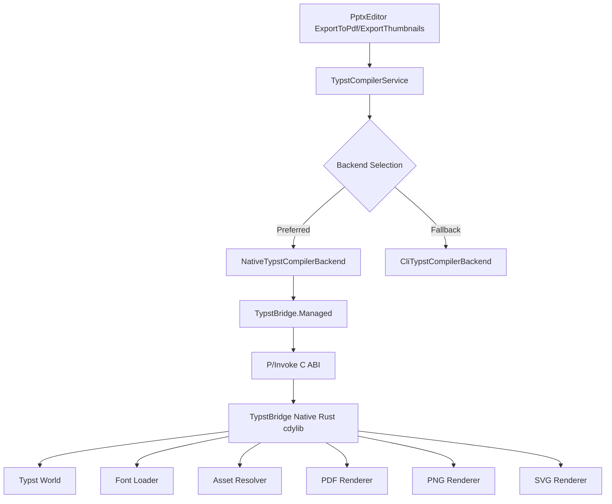
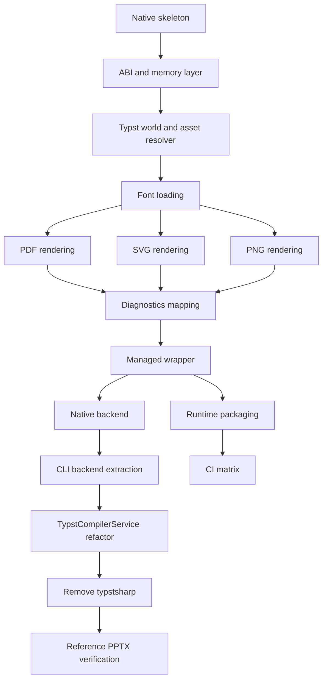

# TypstBridge Implementation Plan

## Objective

Replace `typstsharp` with a first-party native bridge around Typst's Rust crates.

The bridge must support the complete current Typst compile surface before `typstsharp` is removed:

- PDF output
- PNG output
- SVG output
- Multi-page outputs
- Source string input
- Working directory for relative assets such as `assets/...`
- Font path and font directory support
- PNG PPI configuration
- Structured diagnostics and error messages
- Safe memory ownership across Rust and C#
- Native runtime asset packaging for Linux, Windows, and macOS

The external `typst` CLI fallback may remain as a safety net, but the project should not depend on `typstsharp` after this migration is complete.

## Non-Goals

- Do not reimplement Typst in C#.
- Do not permanently ship a partial wrapper that only supports PDF.
- Do not remove `typstsharp` before native PDF, PNG, and SVG are working through the bridge.

## Proposed Structure

```text
TypstBridge/
├── README.md
├── docs/
│   ├── implementation-plan.md
│   └── abi.md
├── native/
│   ├── Cargo.toml
│   ├── build.rs
│   ├── .cargo/
│   │   └── config.toml
│   └── src/
│       ├── lib.rs
│       ├── abi.rs
│       ├── memory.rs
│       ├── compiler.rs
│       ├── world.rs
│       ├── fonts.rs
│       ├── assets.rs
│       ├── diagnostics.rs
│       ├── render_pdf.rs
│       ├── render_png.rs
│       └── render_svg.rs
├── managed/
│   ├── TypstBridge.Managed.csproj
│   ├── Native/
│   │   ├── TypstBridgeNative.cs
│   │   ├── NativeLibraryResolver.cs
│   │   └── SafeHandles.cs
│   ├── Models/
│   │   ├── TypstCompileRequest.cs
│   │   ├── TypstCompileResult.cs
│   │   ├── TypstOutputFile.cs
│   │   ├── TypstOutputFormat.cs
│   │   ├── TypstDiagnostic.cs
│   │   └── TypstBridgeException.cs
│   └── TypstBridgeCompiler.cs
├── packaging/
│   ├── build-native.sh
│   ├── build-native.ps1
│   ├── pack-runtime-assets.sh
│   └── README.md
└── tests/
    ├── TypstBridge.Managed.Tests/
    ├── fixtures/
    │   ├── minimal.typ
    │   ├── multipage.typ
    │   ├── image-assets.typ
    │   └── fonts.typ
    └── native-smoke/
```

Runtime asset layout:

```text
runtimes/
├── linux-x64/native/libtypst_bridge.so
├── linux-arm64/native/libtypst_bridge.so
├── win-x64/native/typst_bridge.dll
├── win-arm64/native/typst_bridge.dll
├── osx-x64/native/libtypst_bridge.dylib
└── osx-arm64/native/libtypst_bridge.dylib
```

## Architecture



## Phase 1: Foundation

### 1. Create Native Skeleton

- Add `TypstBridge/native` Rust crate.
- Configure `crate-type = ["cdylib"]`.
- Add initial exported functions:
  - `typst_bridge_abi_version`
  - `typst_bridge_version`
  - `typst_bridge_probe`
- Add panic guards for FFI entrypoints.

Acceptance criteria:

- `cargo build --release` produces a native shared library.
- Version and probe functions are callable.

### 2. Implement ABI and Memory Layer

- Define C-compatible request, result, output, and diagnostic structs.
- Convert UTF-8 pointer/length inputs safely.
- Allocate all returned output buffers in Rust.
- Implement `typst_bridge_free_result`.
- Ensure panics never unwind across FFI.

Acceptance criteria:

- Invalid pointers produce structured errors when possible.
- Repeated result allocation/free cycles do not crash.

## Phase 2: Full Native Compile Surface

### 3. Implement Typst World

- Build a custom Typst world backed by source string input.
- Use `working_dir` for relative file resolution.
- Resolve PPTX-generated `assets/...` image paths.
- Support root file name, defaulting to `main.typ`.
- Cache loaded assets during compilation.
- Return clear diagnostics for missing files.

Acceptance criteria:

- Typst source using `#image("assets/foo.png")` resolves against `working_dir`.
- Missing assets produce useful diagnostics.

### 4. Implement Font Loading

- Load fonts from explicit font files.
- Load fonts recursively from font directories.
- Decide and document system font discovery behavior.
- Preserve current PPTX requirements around embedded fonts and Carlito fallback.
- Avoid overriding embedded PPTX fonts with unrelated global font paths.

Acceptance criteria:

- A document using a font from a provided font directory compiles.
- Invalid font paths produce diagnostics, not crashes.

### 5. Implement PDF Rendering

- Compile Typst source to a document.
- Render document to PDF bytes.
- Return one output item for the PDF.

Acceptance criteria:

- Minimal source returns bytes beginning with `%PDF`.
- Multi-page source returns one valid multi-page PDF.

### 6. Implement SVG Rendering

- Render each page to SVG.
- Return one output item per page.
- Preserve page ordering.

Acceptance criteria:

- Single-page source returns one SVG output.
- Multi-page source returns N SVG outputs.
- SVG outputs start with SVG/XML text.

### 7. Implement PNG Rendering

- Rasterize each page to PNG.
- Apply requested PPI.
- Return one output item per page.
- Validate PPI range.

Acceptance criteria:

- Single-page source returns one PNG with PNG magic bytes.
- Multi-page source returns N PNG outputs.
- PPI changes output dimensions.

### 8. Implement Diagnostics Mapping

- Convert Typst compile/render diagnostics to ABI diagnostics.
- Include severity, message, file, line, and column when available.
- Provide a combined human-readable message.

Acceptance criteria:

- Invalid Typst source returns structured diagnostics.
- Missing asset diagnostics include the missing path.

## Phase 3: Managed Integration

### 9. Create Managed Wrapper

- Add `TypstBridge/managed/TypstBridge.Managed.csproj`.
- Add P/Invoke declarations.
- Add native library resolver if default runtime resolution is insufficient.
- Add managed request/result models.
- Use safe handles or equivalent ownership wrappers.

Acceptance criteria:

- Managed code can call version/probe.
- Managed code can compile PDF, PNG, and SVG through native bridge.

### 10. Add Compiler Backend Abstraction

- Define an internal backend interface in `OfficeEditor.Core`, for example `ITypstCompilerBackend`.
- Implement `NativeTypstCompilerBackend` using `TypstBridge.Managed`.
- Extract current CLI logic into `CliTypstCompilerBackend`.
- Refactor `TypstCompilerService` to select native first, CLI fallback second.

Acceptance criteria:

- Existing callers keep using `TypstCompilerService` unchanged.
- Native load/probe failure falls back to CLI.
- Error messages identify attempted backends.

### 11. Remove typstsharp

Only after native PDF, PNG, and SVG are verified:

- Remove `typstsharp` from `OfficeEditor.Core/OfficeEditor.Core.csproj`.
- Remove `typstsharp` from `PptxEditor.Core/PptxEditor.Core.csproj`.
- Remove reflection probing code.
- Remove stale docs/comments that say `typstsharp` is required.

Acceptance criteria:

- Searching the repo finds no active `typstsharp` dependency.
- Solution restores and builds without `typstsharp`.

## Phase 4: Packaging and Build

### 12. Native Build Scripts

- Add Linux shell build script.
- Add Windows PowerShell build script.
- Add macOS build notes or script.
- Copy artifacts to `runtimes/<rid>/native`.

Acceptance criteria:

- Linux build creates `runtimes/linux-x64/native/libtypst_bridge.so`.
- Scripts fail clearly if Rust is missing.

### 13. Linux Hardened Kernel Support

- Add Linux linker flags for non-executable stack, for example:

```text
-C link-arg=-Wl,-z,noexecstack
```

- Verify with `readelf` or equivalent where available.
- Document why this is required.

Acceptance criteria:

- Built Linux shared object does not require executable stack.
- Bridge loads on hardened Linux kernels where `typstsharp` fails.

### 14. Runtime Asset Packaging

- Include native libraries as .NET runtime assets.
- Ensure they copy to test, build, and publish output.
- Add explicit native resolver if required.

Acceptance criteria:

- `dotnet test` can load the native bridge without manual `LD_LIBRARY_PATH`.
- Published apps include the correct native library for the target RID.

## Phase 5: Tests and Verification

### 15. Rust Tests

- Minimal PDF compile.
- Invalid syntax diagnostics.
- Missing asset diagnostics.
- Font path loading.
- Multi-page output count.
- PNG PPI behavior.

### 16. ABI Smoke Tests

- Version/probe.
- Compile PDF through raw ABI.
- Compile PNG through raw ABI.
- Compile SVG through raw ABI.
- Repeated compile/free loop.
- Invalid request handling.

### 17. Managed Tests

- Native library resolution.
- PDF signature `%PDF`.
- PNG signature.
- SVG text signature.
- Multi-page output counts.
- Diagnostics mapping.
- Backend selection and CLI fallback.

### 18. OfficeEditor Integration Tests

- `TypstCompilerService` PDF compile.
- `TypstCompilerService` PNG compile.
- `TypstCompilerService` SVG compile.
- Working directory asset resolution.
- Font directory propagation.
- Native-to-CLI fallback.

### 19. PPTX Reference Verification

Verify against existing reference files:

- `examples/REF/REMOVED.pptx`
- `examples/REF/pres-pro.pptx`

Checks:

- PDF conversion succeeds.
- PNG conversion succeeds.
- Page counts match.
- Output signatures are valid.
- Visual regression comparison is acceptable.
- No broad visual-fidelity changes are introduced as part of bridge migration.

## Risk Register

### Typst Rust API Instability

Typst crates may change embedding APIs. Pin exact versions and isolate Typst-specific code in Rust modules.

### Font Discovery Differences

Native bridge output may differ from CLI or `typstsharp`. Document font precedence and verify reference PPTX outputs.

### Asset Path Resolution

PPTX-generated Typst depends on relative `assets/...` paths. Keep working directory handling explicit and tested.

### PNG Rasterization Complexity

PNG output requires correct rasterization and PPI handling. Test output dimensions at multiple PPI values.

### Memory Ownership Bugs

Rust allocates and Rust frees. Add stress tests around compile/free loops.

### Platform Packaging

Native loading can fail after publish. Use standard RID runtime asset layout and keep CLI fallback.

### Linux Hardening

The bridge must not reproduce `typstsharp`'s executable-stack problem. Enforce and verify `noexecstack`.

### Licensing

Audit Typst and transitive crate licenses before distributing native binaries.

## Dependency Graph



## Done Criteria

The migration is complete only when all of these are true:

- `TypstBridge/` contains the Rust native bridge and managed wrapper.
- The native bridge supports PDF, PNG, and SVG.
- Multi-page PNG/SVG outputs are returned in correct page order.
- Source string, working directory, asset paths, font paths, and PNG PPI are supported.
- Diagnostics are structured and exposed to C#.
- Rust-owned memory is released through bridge free functions.
- Linux build uses non-executable stack flags.
- Native runtime assets are packaged for supported RIDs.
- `TypstCompilerService` uses backend abstraction.
- Native bridge is preferred and CLI fallback remains available.
- `typstsharp` package references are removed.
- `dotnet test` passes in an environment with .NET 9 runtime.
- Rust tests pass.
- Reference PPTX conversions pass for `REMOVED` and `pres-pro`.
- Documentation explains build, loading, fallback, font handling, platform support, and Linux hardening.
