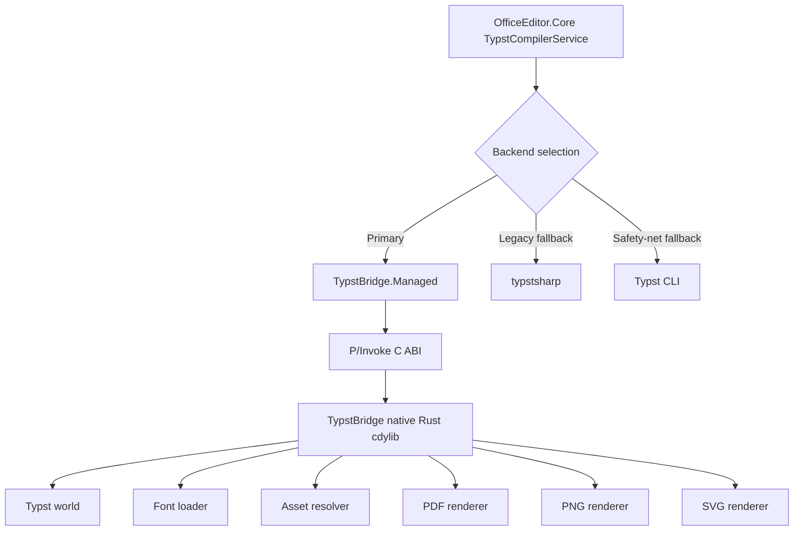

# TypstBridge Implementation Status

This document records the TypstBridge implementation plan and its current status. TypstBridge is no longer only a standalone experiment: OfficeEditor.Core's `TypstCompilerService` now uses it as the primary Typst backend.

## Current state

- Native Rust `cdylib` lives under `TypstBridge/native`.
- Managed .NET 9 P/Invoke wrapper lives under `TypstBridge/managed`.
- The bridge supports source-string compilation through a native Typst world.
- Relative imports and assets resolve from the request working directory.
- Explicit font files and font directories can be supplied.
- PDF, SVG, and PNG rendering are supported natively.
- PDF returns one output item; SVG and PNG return one output per page in page order.
- PNG rendering accepts PPI configuration.
- Diagnostics are exposed through the native ABI and mapped into managed results.
- OfficeEditor.Core's `TypstCompilerService` tries TypstBridge first.
- The external Typst CLI remains the safety-net fallback.
- `typstsharp` remains present as a fallback/legacy path and is not removed by the TypstBridge work.
- Runtime asset scripts provide the expected .NET RID layout.
- On Linux x64, the managed project can auto-build `runtimes/linux-x64/native/libtypst_bridge.so` when it is missing and Rust/`cargo` are available.

## Non-goals

- Do not reimplement Typst in C#.
- Do not claim full platform packaging until each RID has been built and publish-verified.
- Do not remove `typstsharp` as part of documentation or packaging updates. Any removal should be a separate cleanup with fallback and reference-output verification.
- Do not remove the external Typst CLI fallback; it remains the safety net.

## Implemented compile surface

| Capability | Status |
| --- | --- |
| PDF output | Implemented natively. |
| SVG output | Implemented natively, one output per page. |
| PNG output | Implemented natively, one output per page. |
| Multi-page outputs | Implemented for SVG/PNG. |
| Source string input | Implemented. |
| Working directory assets | Implemented for relative paths such as `assets/...`. |
| Explicit font paths | Implemented for files and directories. |
| PNG PPI | Implemented. |
| Diagnostics | Implemented through ABI and managed wrapper. |
| Linux x64 runtime asset auto-build | Implemented for local source builds when the asset is missing. |
| Full platform packaging matrix | Preliminary; requires explicit verification per RID. |

## Runtime asset layout

Native libraries are expected under the standard .NET runtime asset layout:

```text
TypstBridge/runtimes/
├── linux-x64/native/libtypst_bridge.so
├── linux-arm64/native/libtypst_bridge.so
├── win-x64/native/typst_bridge.dll
├── win-arm64/native/typst_bridge.dll
├── osx-x64/native/libtypst_bridge.dylib
└── osx-arm64/native/libtypst_bridge.dylib
```

The layout is defined for all listed RIDs, but verified packaging support is still preliminary outside the currently targeted build paths. Generated files under `TypstBridge/runtimes/` are build outputs and should not be committed unless the packaging policy changes.

## Architecture



## Build and verification

Build the native runtime asset explicitly from the repository root:

```bash
TypstBridge/packaging/build-native.sh linux-x64
```

Run managed bridge tests:

```bash
dotnet test TypstBridge/tests/TypstBridge.Managed.Tests/TypstBridge.Managed.Tests.csproj
```

Optional native checks:

```bash
cargo test --manifest-path TypstBridge/native/Cargo.toml
```

On Linux x64, building `TypstBridge.Managed` or a referencing project can run the native build automatically when the Linux x64 runtime asset is missing. This path requires Rust and `cargo` on clean source builds.

## Remaining work

- Verify reference PPTX conversions through the OfficeEditor.Core path for `examples/REF/PPTX/pres-pro.pptx` and `examples/REF/PPTX/AetherLink-Glass-Shareholder-Overview.pptx`.
- Confirm publish output includes the correct native runtime asset for each supported RID.
- Expand and verify the platform matrix before distributing native packages.
- Document any final font precedence decisions after reference verification.
- Keep CLI fallback behavior tested and visible in error messages.
- Treat `typstsharp` removal as a separate dependency cleanup, not as part of TypstBridge integration.

## Risks and constraints

### Platform packaging

Native loading can fail after publish if runtime assets are missing or placed incorrectly. Keep the standard RID layout and retain CLI fallback behavior.

### Linux hardening

Linux builds must not request an executable stack. The Bash build script passes `-C link-arg=-Wl,-z,noexecstack`; verify Linux artifacts with `readelf` where available.

### Font discovery differences

Native bridge output may differ from CLI or `typstsharp`. Verify reference PPTX outputs before changing fallback or dependency behavior.

### Typst Rust API instability

Typst crates may change embedding APIs. Keep Typst-specific code isolated in the Rust bridge.

### Licensing

Audit Typst and transitive crate licenses before distributing native binaries.

## Done criteria for a packaging release

- Native bridge supports PDF, PNG, and SVG.
- Multi-page PNG/SVG outputs are returned in page order.
- Source strings, working directories, asset paths, font paths, and PNG PPI are supported.
- Diagnostics are structured and exposed to C#.
- Rust-owned memory is released through bridge free functions.
- Linux builds use non-executable stack flags.
- OfficeEditor.Core prefers TypstBridge and retains CLI fallback.
- Runtime assets are verified in publish output for the target RID.
- Reference PPTX conversions pass for the release target.
- Documentation explains build, loading, fallback, font handling, platform support, and Linux hardening.
