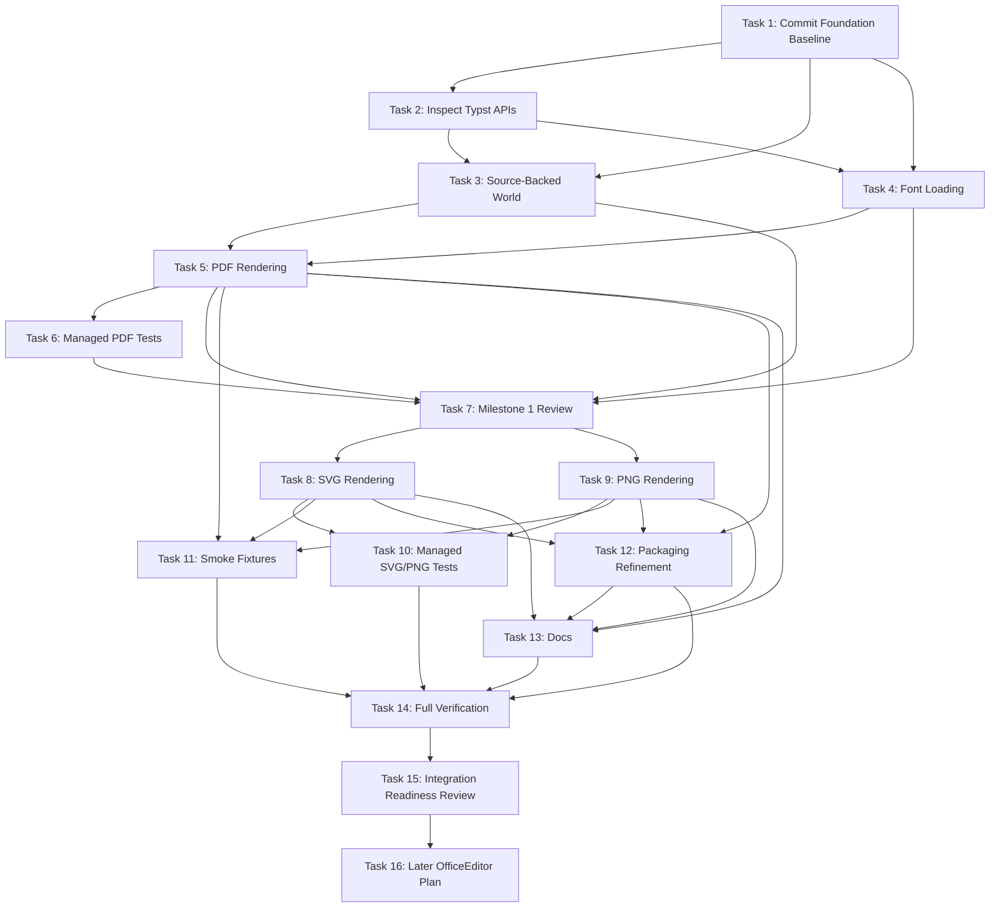
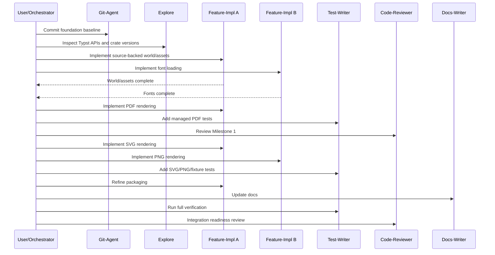

# Plan: TypstBridge Next Implementation Phases

## Goal

Advance TypstBridge from the completed ABI/P\Invoke foundation to a real Typst rendering bridge with parity targets for PDF, SVG, PNG, multi-page output, fonts, assets, diagnostics, and packaging. OfficeEditor/PptxEditor integration remains explicitly out of scope until the bridge can compile real outputs reliably through managed and native tests.

## Current Progress Overview

Foundation work is complete but expected to be committed separately by `@git-agent` before new implementation starts:

- Native Rust `cdylib` scaffold under `TypstBridge/native`.
- ABI v2 exports for version, probe, compile, result free, and last error.
- Compile request validation exists and currently returns `Unsupported` for real rendering.
- Explicit pointer+length UTF-8 strings, including font path arrays.
- Rust-owned result memory is freed using boxed slices.
- Managed .NET 9 P/Invoke wrapper with explicit UTF-8 marshalling and runtime asset support.
- Packaging scripts and runtime layout foundation.
- Verification already passed: `cargo fmt`, `cargo check`, `cargo test`, managed `dotnet build`, and `bash -n` for packaging scripts.

## Scope Boundaries

- All implementation work must stay under `TypstBridge/` for these milestones.
- Do not touch OfficeEditor/PptxEditor integration until native and managed bridge tests prove PDF, SVG, PNG, multi-page, fonts, assets, diagnostics, and packaging behavior.
- Keep the external Typst CLI fallback as the safety net until native parity is demonstrated.
- Do not remove `typstsharp` as part of these milestones.
- Do not commit unless explicitly requested by the user.

## Proposed Milestones

### Milestone 1: Native Typst World, Assets, Fonts, and PDF Output

Produce valid PDF bytes from source strings using a custom Typst world that supports relative assets and explicit font paths.

### Milestone 2: SVG and PNG Multi-Page Rendering

Render every Typst page as ordered per-page SVG/PNG outputs, honoring requested PPI for PNG.

### Milestone 3: Managed/Native Tests and Packaging Refinement

Turn the bridge into a testable, packageable component with native smoke tests, managed integration tests, deterministic fixtures, and runtime asset validation.

### Later Milestone 4: OfficeEditor Backend Integration Gate

Only after Milestones 1-3 pass, plan and implement an OfficeEditor/PptxEditor backend that prefers TypstBridge and preserves CLI fallback.

## Atomic Tasks

### Task 1: Commit Foundation Baseline

- **Description**: Commit the already-completed foundation before feature work begins so follow-up diffs are isolated.
- **Complexity**: Low
- **Dependencies**: None
- **Agent**: `@git-agent`
- **Deliverable**: One conventional commit containing only the current TypstBridge foundation changes.
- [ ] Run `git status`, `git diff`, and recent `git log`.
- [ ] Ensure only intended TypstBridge foundation files are staged.
- [ ] Commit with a conventional message such as `feat: add TypstBridge ABI foundation`.

### Task 2: Inspect Typst Crate APIs and Lock Rendering Versions

- **Description**: Confirm exact Typst crate versions and APIs for world implementation, PDF export, SVG export, and rasterization before coding.
- **Complexity**: Medium
- **Dependencies**: Task 1 preferred
- **Agent**: `@explore`
- **Deliverable**: Short implementation note in the agent result identifying chosen crates/functions and any version constraints.
- [ ] Inspect existing `Cargo.toml` dependencies.
- [ ] Identify APIs for `World`, source files, font book, PDF export, SVG export, and PNG rasterization.
- [ ] Identify whether PNG requires additional crates/features.
- [ ] Flag any Typst version/API mismatch risks before implementation begins.

### Task 3: Implement Source-Backed Typst World

- **Description**: Add a custom world that compiles the request source string as the root Typst file and resolves imports/assets relative to `working_dir`.
- **Complexity**: High
- **Dependencies**: Tasks 1, 2
- **Agent**: `@feature-impl`
- **Deliverable**: Native compile path reaches Typst compilation for source-only documents and asset references.
- [ ] Add or complete `world.rs`/`assets.rs` under `TypstBridge/native/src`.
- [ ] Represent root source using `root_file_name`, defaulting to `main.typ`.
- [ ] Resolve relative paths against `working_dir` without escaping expected filesystem behavior.
- [ ] Cache loaded assets during a compile request.
- [ ] Convert missing asset/import failures into bridge diagnostics.
- [ ] Add focused native unit tests for path resolution and missing asset diagnostics.

### Task 4: Implement Font Loading Strategy

- **Description**: Load explicit font files/directories from request font paths and define safe fallback behavior for system fonts.
- **Complexity**: High
- **Dependencies**: Tasks 1, 2
- **Agent**: `@feature-impl`
- **Deliverable**: Typst documents can use fonts supplied through `font_paths`; invalid paths produce diagnostics/errors, not crashes.
- [ ] Add or complete `fonts.rs`.
- [ ] Support explicit font files.
- [ ] Support recursive font directory loading.
- [ ] Preserve path ordering so embedded/PPTX-provided fonts can take precedence later.
- [ ] Decide initial system font behavior and document it in code comments or docs.
- [ ] Add native tests for file font path, directory font path, and invalid font path.

### Task 5: Implement Native PDF Rendering

- **Description**: Wire compile success to Typst PDF export and return one ABI output item containing valid PDF bytes.
- **Complexity**: Medium
- **Dependencies**: Tasks 3, 4
- **Agent**: `@feature-impl`
- **Deliverable**: `typst_bridge_compile` returns `OK` plus one `%PDF` output for minimal and multi-page sources.
- [ ] Add or complete `render_pdf.rs`.
- [ ] Map compile diagnostics and rendering errors into ABI diagnostics/status.
- [ ] Return file name using the requested root name or a deterministic `output.pdf` convention.
- [ ] Preserve Rust-owned output memory/free behavior.
- [ ] Add native smoke tests for minimal PDF and multi-page PDF.

### Task 6: Add Managed PDF Integration Tests

- **Description**: Verify .NET wrapper calls native PDF rendering and marshals outputs/diagnostics safely.
- **Complexity**: Medium
- **Dependencies**: Task 5
- **Agent**: `@test-writer`
- **Deliverable**: Managed tests prove minimal PDF, multi-page PDF, and failure diagnostics work through P/Invoke.
- [ ] Create/extend `TypstBridge` managed test project under `TypstBridge/tests` if not already present.
- [ ] Add fixture for minimal source.
- [ ] Add fixture for multi-page source.
- [ ] Assert output count, format, page index, file name, and `%PDF` header.
- [ ] Assert missing asset produces meaningful managed diagnostic/exception behavior.

### Task 7: Milestone 1 Review Gate

- **Description**: Review native world/font/PDF changes before moving to SVG/PNG.
- **Complexity**: Low
- **Dependencies**: Tasks 3, 4, 5, 6
- **Agent**: `@code-reviewer`
- **Deliverable**: Review result with blocking issues fixed before Milestone 2.
- [ ] Check FFI memory safety.
- [ ] Check path handling and diagnostics quality.
- [ ] Check tests cover success and failure paths.

### Task 8: Implement Native SVG Rendering

- **Description**: Render each compiled Typst page as a separate SVG output item in page order.
- **Complexity**: Medium
- **Dependencies**: Task 7
- **Agent**: `@feature-impl`
- **Deliverable**: SVG format requests return one output per page with ordered page indexes.
- [ ] Add or complete `render_svg.rs`.
- [ ] Generate deterministic per-page file names such as `page-001.svg`.
- [ ] Ensure multi-page documents return N outputs.
- [ ] Add native tests for single-page and multi-page SVG.

### Task 9: Implement Native PNG Rendering with PPI

- **Description**: Rasterize each compiled Typst page to PNG using request `ppi` and return ordered per-page outputs.
- **Complexity**: High
- **Dependencies**: Task 7 and Task 2 API findings
- **Agent**: `@feature-impl`
- **Deliverable**: PNG format requests return valid PNG bytes for every page and respect PPI changes.
- [ ] Add or complete `render_png.rs`.
- [ ] Validate `ppi` and choose documented default behavior.
- [ ] Generate deterministic per-page file names such as `page-001.png`.
- [ ] Add native tests for PNG signature and multi-page output count.
- [ ] Add a test that different PPI values affect raster dimensions or output metadata where practical.

### Task 10: Add Managed SVG/PNG Multi-Page Tests

- **Description**: Verify managed marshalling for per-page SVG and PNG output arrays.
- **Complexity**: Medium
- **Dependencies**: Tasks 8, 9
- **Agent**: `@test-writer`
- **Deliverable**: Managed tests cover SVG/PNG output count, ordering, signatures, PPI, and free-result stability.
- [ ] Assert SVG outputs are ordered and start with XML/SVG text.
- [ ] Assert PNG outputs are ordered and start with PNG signature bytes.
- [ ] Assert multi-page fixtures produce expected count for both formats.
- [ ] Add repeated compile/free loop test to detect marshalling or lifetime regressions.

### Task 11: Build Native Smoke Fixtures

- **Description**: Add compact fixtures covering source-only, multi-page, image asset, font path, and invalid input scenarios.
- **Complexity**: Low
- **Dependencies**: Tasks 5, 8, 9
- **Agent**: `@test-writer`
- **Deliverable**: Fixture set under `TypstBridge/tests/fixtures` usable by native and managed tests.
- [ ] Add `minimal.typ`.
- [ ] Add `multipage.typ`.
- [ ] Add `image-assets.typ` plus a tiny checked-in image asset.
- [ ] Add `fonts.typ` using a small allowed test font if available, or document dependency on system fallback.
- [ ] Add invalid/missing asset fixture.

### Task 12: Refine Runtime Asset Packaging

- **Description**: Ensure native build outputs are placed in the runtime layout consumed by managed tests and future NuGet packaging.
- **Complexity**: Medium
- **Dependencies**: Tasks 5, 8, 9 can proceed mostly in parallel; final validation depends on them
- **Agent**: `@feature-impl`
- **Deliverable**: Packaging scripts produce expected `runtimes/<rid>/native` layout and managed build/test can locate the library.
- [ ] Verify Linux x64 debug/release copy behavior.
- [ ] Add guardrails for unsupported RID/OS combinations.
- [ ] Ensure scripts fail fast on missing native artifact.
- [ ] Keep scripts shellcheck-friendly where practical.
- [ ] Update packaging README if commands or layout changed.

### Task 13: Document Bridge Behavior and Milestone Status

- **Description**: Update TypstBridge docs to reflect real support status and usage constraints.
- **Complexity**: Low
- **Dependencies**: Tasks 5, 8, 9, 12
- **Agent**: `@docs-writer`
- **Deliverable**: Documentation explains supported formats, font paths, assets, diagnostics, packaging, and known limitations.
- [ ] Update `TypstBridge/README.md` or docs under `TypstBridge/docs`.
- [ ] Document that CLI fallback remains outside this bridge.
- [ ] Document no OfficeEditor integration yet.
- [ ] Update ABI docs only if the ABI changes.

### Task 14: Full Bridge Verification Gate

- **Description**: Run all required native, managed, and packaging validation after Milestones 1-3.
- **Complexity**: Medium
- **Dependencies**: Tasks 6, 10, 11, 12, 13
- **Agent**: `@test-writer` or `@general`
- **Deliverable**: Verification log showing bridge parity gate status.
- [ ] Run `cargo fmt --check` in `TypstBridge/native`.
- [ ] Run `cargo check` in `TypstBridge/native`.
- [ ] Run `cargo test` in `TypstBridge/native`.
- [ ] Run managed `dotnet build` for `TypstBridge/managed`.
- [ ] Run managed tests under `TypstBridge/tests`.
- [ ] Run `bash -n` for packaging scripts.
- [ ] Run packaging script smoke path for current RID if safe.

### Task 15: Milestone 3 Review and Integration Readiness Decision

- **Description**: Review the completed bridge and decide if it is ready for an OfficeEditor backend plan.
- **Complexity**: Low
- **Dependencies**: Task 14
- **Agent**: `@code-reviewer`, then user decision
- **Deliverable**: Explicit go/no-go result for later OfficeEditor integration.
- [ ] Review memory ownership and repeated compile/free behavior.
- [ ] Review diagnostics and failure behavior.
- [ ] Review runtime asset packaging assumptions.
- [ ] Confirm PDF/SVG/PNG/multi-page/font/asset parity is sufficient.
- [ ] Ask user before planning or touching OfficeEditor/PptxEditor code.

### Task 16: Later OfficeEditor Backend Plan Only

- **Description**: Create a separate integration plan after bridge readiness is accepted.
- **Complexity**: Medium
- **Dependencies**: Task 15 and explicit user approval
- **Agent**: `@planner`
- **Deliverable**: Separate plan for native backend selection, CLI fallback preservation, visual regression, and rollout.
- [ ] Inventory existing TypstCompilerService backend seams.
- [ ] Design feature flag/configuration for bridge vs CLI.
- [ ] Define visual regression against `examples/REF/`.
- [ ] Do not implement until user approves the integration phase.

## Dependency Graph

## Parallelization Strategy

**Can run in parallel after Task 1:**

- Task 2 API inspection can run while `@feature-impl` prepares world/font implementation boundaries, but coding should wait for its findings if Typst APIs are uncertain.
- Tasks 3 and 4 can run in parallel after Task 2 because world/assets and fonts are separable native modules.

**Can run in parallel after Milestone 1 review:**

- Tasks 8 and 9 can run in parallel because SVG and PNG rendering share compiled document input but write separate render modules.
- Task 12 packaging refinement can begin after PDF exists and continue while SVG/PNG are implemented, with final validation after both are complete.
- Task 11 fixtures can begin after PDF fixtures are needed and expand after SVG/PNG are in place.

**Must be sequential:**

- Task 5 depends on Tasks 3 and 4 because PDF compile needs the world and font book.
- Task 6 depends on Task 5 because managed PDF tests require real PDF output.
- Task 7 must complete before SVG/PNG implementation to avoid compounding FFI/world mistakes.
- Task 10 depends on Tasks 8 and 9.
- Task 14 depends on tests, fixtures, packaging, and docs being complete.
- Task 16 must wait for Task 15 plus explicit user approval.

## Verification Gates

### Gate A: Foundation Baseline

- Foundation changes are committed separately by `@git-agent`.
- No OfficeEditor/PptxEditor changes are included.

### Gate B: PDF Bridge Gate

- Native tests pass for minimal PDF, multi-page PDF, missing assets, and invalid fonts.
- Managed tests pass for PDF output and diagnostics.
- Returned PDF bytes start with `%PDF` and are freed safely through the existing ABI.

### Gate C: SVG/PNG Multi-Page Gate

- Native and managed tests prove SVG/PNG return one output per page in order.
- PNG validates requested/default PPI behavior.
- Repeated compile/free tests pass for all formats.

### Gate D: Packaging Gate

- Runtime asset layout works for current development RID.
- Packaging scripts fail fast on missing artifacts.
- Managed tests can locate the native library from the intended runtime path.

### Gate E: Integration Readiness Gate

- `cargo fmt --check`, `cargo check`, `cargo test` pass under `TypstBridge/native`.
- Managed `dotnet build` and TypstBridge managed tests pass.
- Packaging script syntax checks pass.
- Documentation accurately states supported formats and limitations.
- User explicitly approves moving beyond TypstBridge.

## Risk Assessment

- **Typst crate API churn**: Lock versions and document exact APIs in Task 2 before implementation. Keep changes isolated under `TypstBridge/native`.
- **Custom world complexity**: Start with source string, working directory, and asset reads only. Avoid broad package/import feature expansion unless needed by fixtures.
- **Font discovery ambiguity**: User decision may be needed on whether to include system fonts by default or only explicit font paths. Initial safest behavior is explicit paths plus documented fallback decision.
- **PNG rasterization dependencies**: Typst may require additional crates/features for pixel output. Task 2 should identify exact dependency before Task 9.
- **Diagnostics fidelity**: Mapping Typst spans/files into ABI line/column may be incremental. Acceptance should require meaningful messages first, then improve location precision.
- **Native library loading in tests**: Managed tests may fail if runtime copy layout is incomplete. Task 12 should run before full verification.
- **Parallel build locks**: Run conversions/builds sequentially where .NET build artifacts could lock. Avoid parallel `dotnet run` patterns.
- **Premature integration pressure**: Keep OfficeEditor/PptxEditor untouched until Gate E and user approval.

## User Decisions Needed

1. **System fonts policy**: Should TypstBridge discover system fonts automatically, or only use explicit `font_paths` plus packaged/test fonts?
2. **Test font fixture**: Is it acceptable to add a small open-license font under `TypstBridge/tests/fixtures`, or should tests rely on known system fonts such as Carlito?
3. **PNG validation strictness**: Should tests assert exact image dimensions for given PPI, or only signature/output-count initially?
4. **Crate version pinning**: Should Typst-related crates be pinned exactly for reproducibility or use compatible semver ranges during early development?
5. **Integration trigger**: What exact parity result should authorize creating the later OfficeEditor backend plan?

## Recommended Agent Sequence

## Notes

- This plan intentionally extends, rather than replaces, `implementation-plan.md` by turning the next 2-3 milestones into agent-sized execution units.
- If any task discovers that ABI v2 is insufficient, stop and update `abi.md` before continuing implementation.
- Keep all generated artifacts out of commits unless intentionally part of runtime assets or fixtures.
