# PPTX to PDF/PNG Comparison

This document compares the **official PowerPoint PDF export** for each reference PPTX file side-by-side with the **PNG slides generated by the project's PPTX → Typst → PNG pipeline**.

## How these images were produced

- **Official/reference PDFs**: exported from PowerPoint and stored in `examples/REF/PPTX/`.
- **Official PNGs**: rasterized from the reference PDFs at 150 DPI using `pdftocairo`.
- **Generated PNGs**: produced by `tools/convert-pptx`, which converts the PPTX source to Typst and renders it to PNG.
- **RMSE**: per-slide root-mean-square error computed with ImageMagick `compare` between the official and generated PNGs. Values are expressed as a percentage of the maximum possible pixel value (0–255 per channel).

Expected differences come from different layout engines, font metrics, and embedded image handling; exact pixel parity is not expected.

## Summary

| PPTX file | Slides | Average RMSE |
|-----------|--------|--------------|
| [pres-pro.pptx](#pres-propptx) | 16 | 17.29% |

## pres-pro.pptx

- **Source PPTX**: `examples/REF/PPTX/pres-pro.pptx`
- **Reference PDF**: `examples/REF/PPTX/pres-pro.pdf`
- **Total slides**: 16

| Slide | Official PDF (PNG) | Generated PNG | RMSE % |
|:-----:|--------------------|---------------|--------|
| 1 |  |  | 14.03% |
| 2 |  |  | 13.11% |
| 3 |  |  | 8.97% |
| 4 | 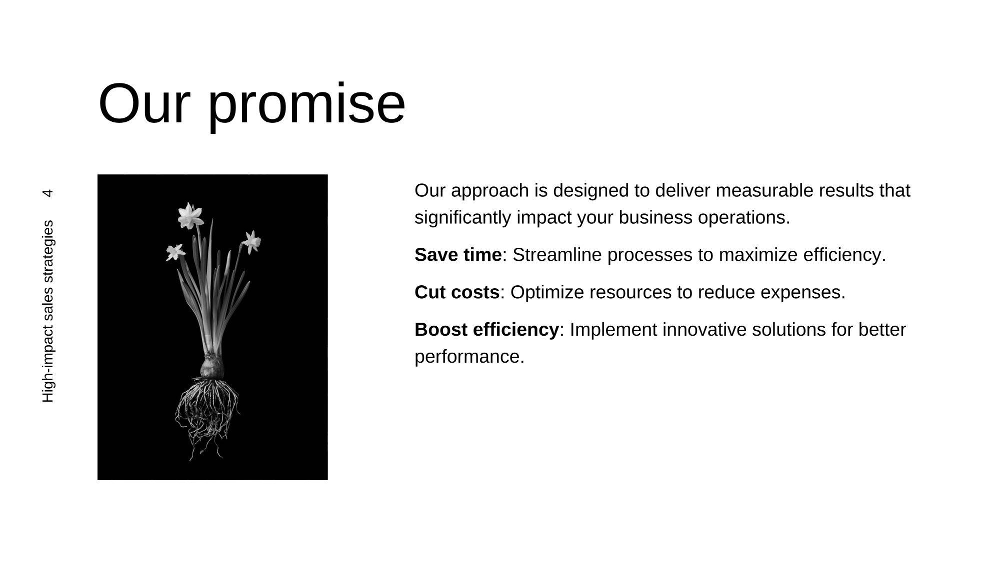 | 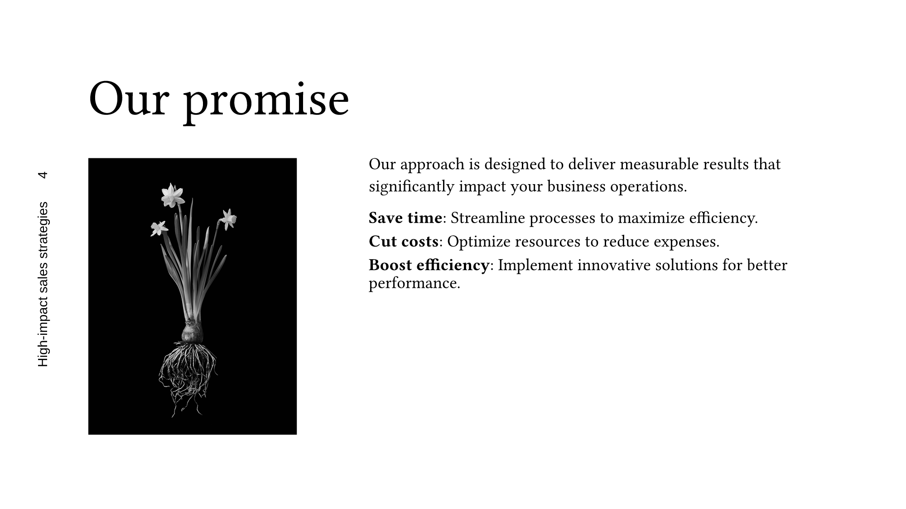 | 18.00% |
| 5 |  |  | 23.46% |
| 6 |  |  | 12.99% |
| 7 |  |  | 19.86% |
| 8 | 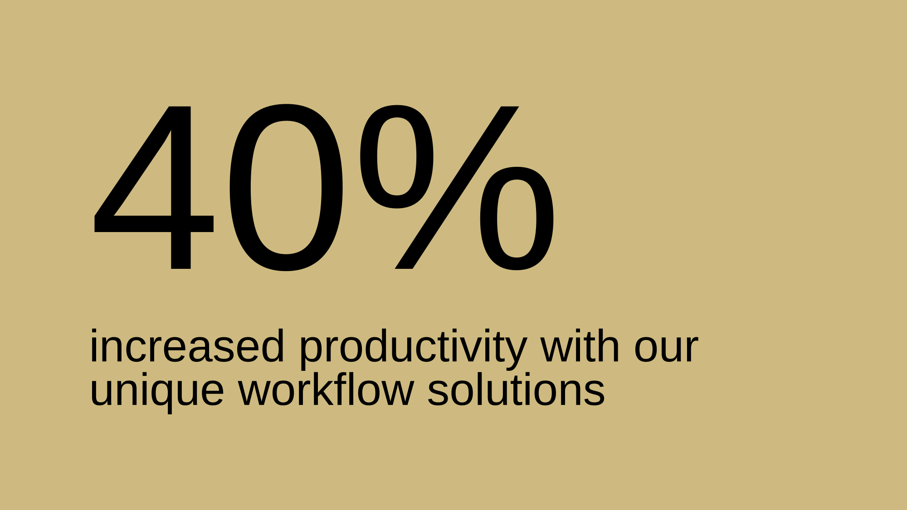 | 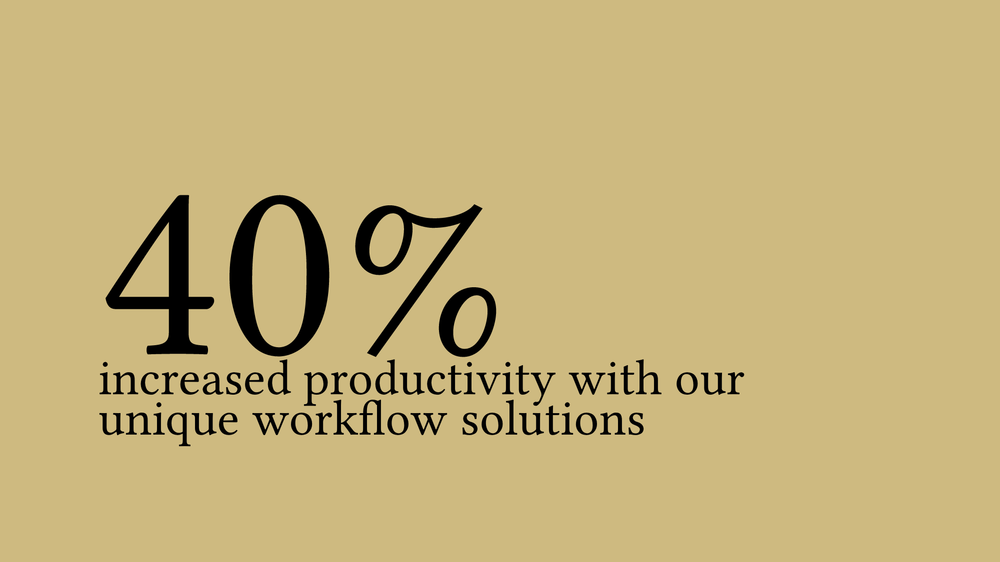 | 21.93% |
| 9 | 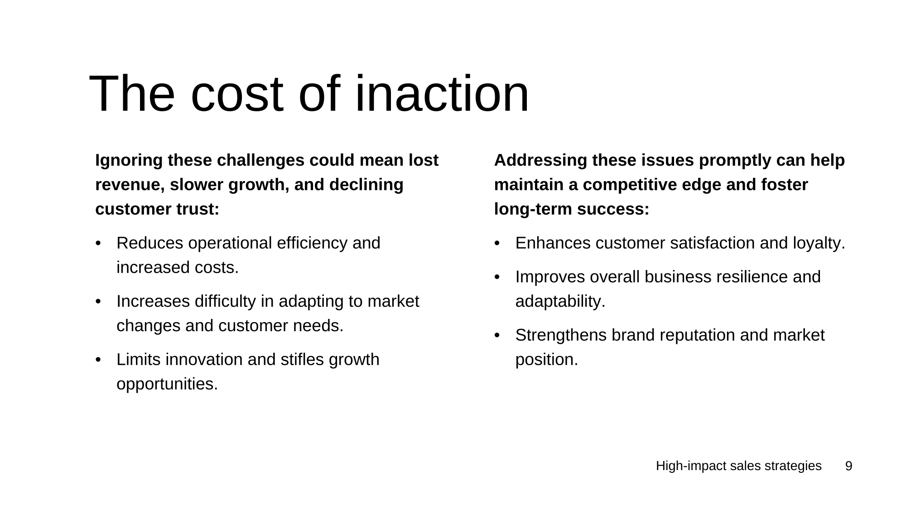 | 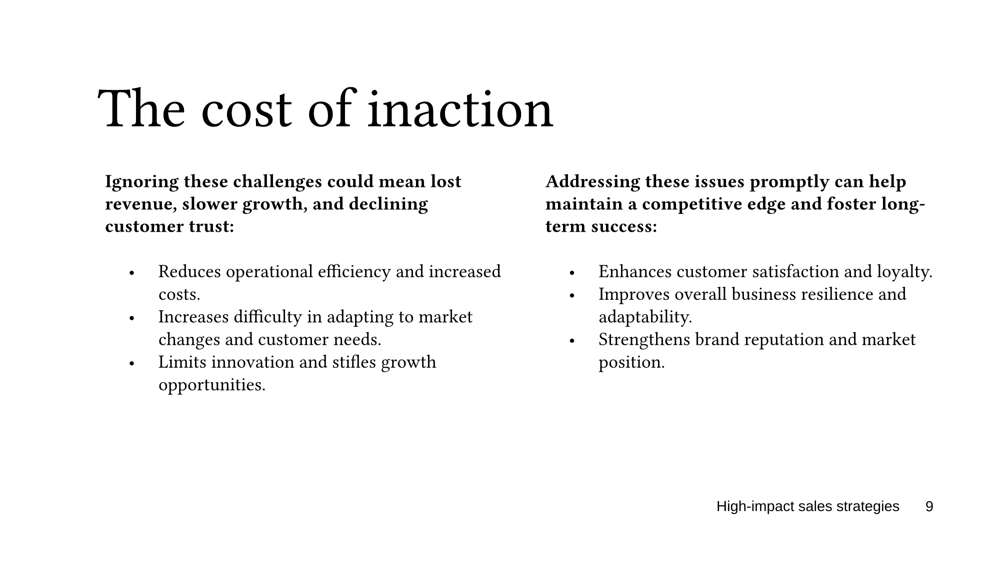 | 23.26% |
| 10 |  | 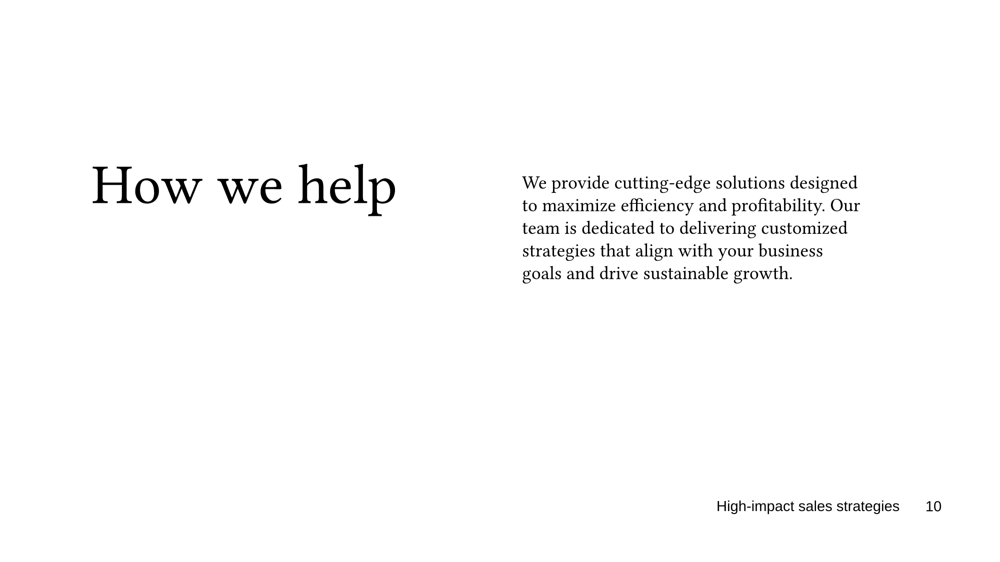 | 15.00% |
| 11 | 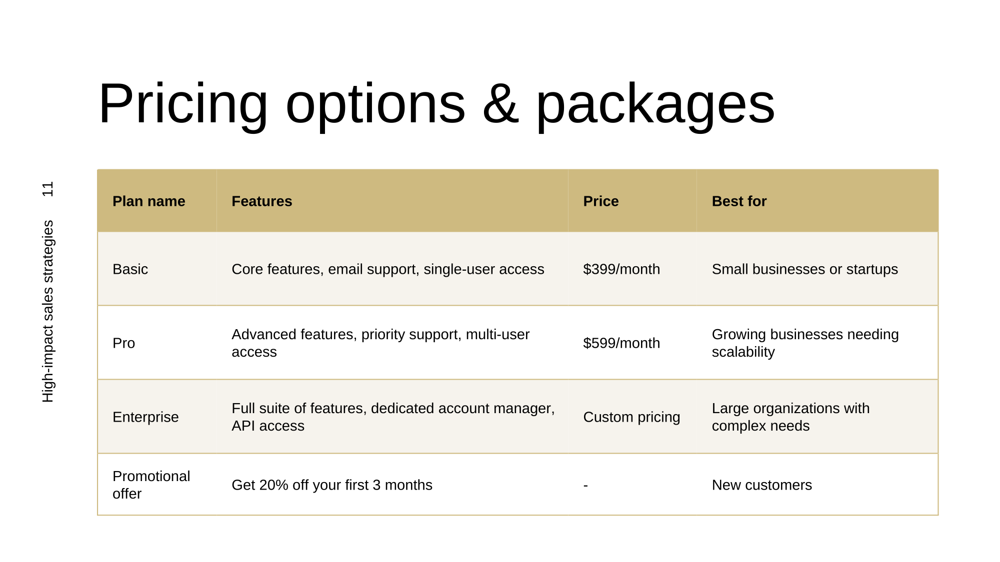 | 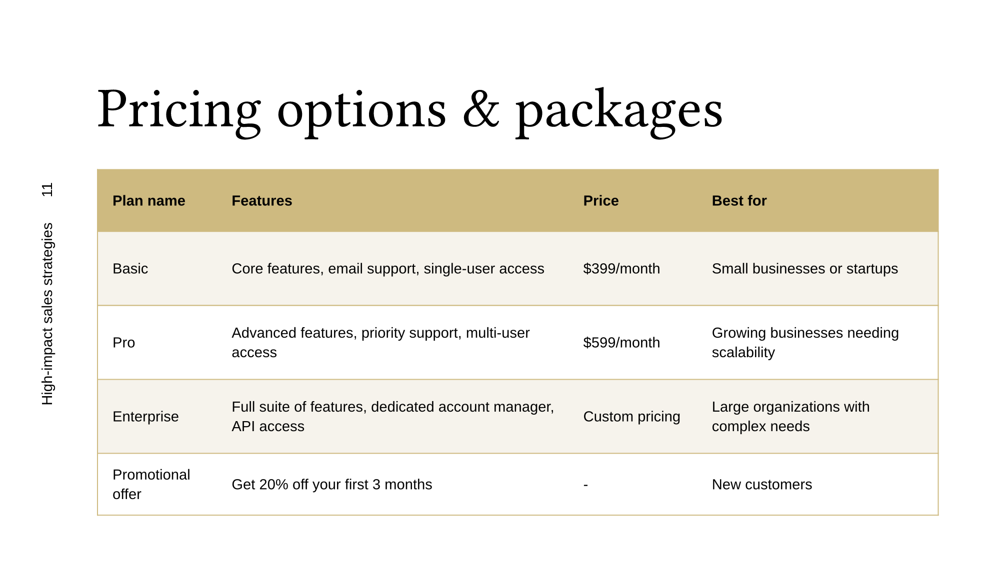 | 16.18% |
| 12 |  |  | 12.94% |
| 13 | 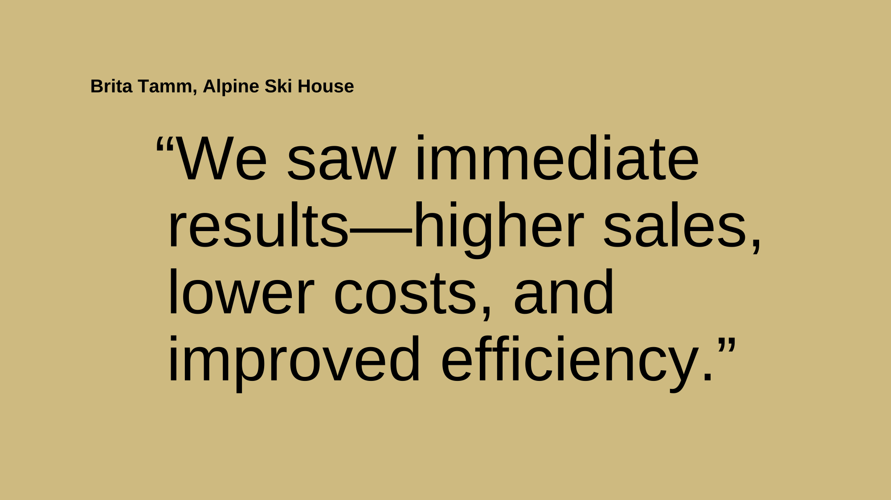 | 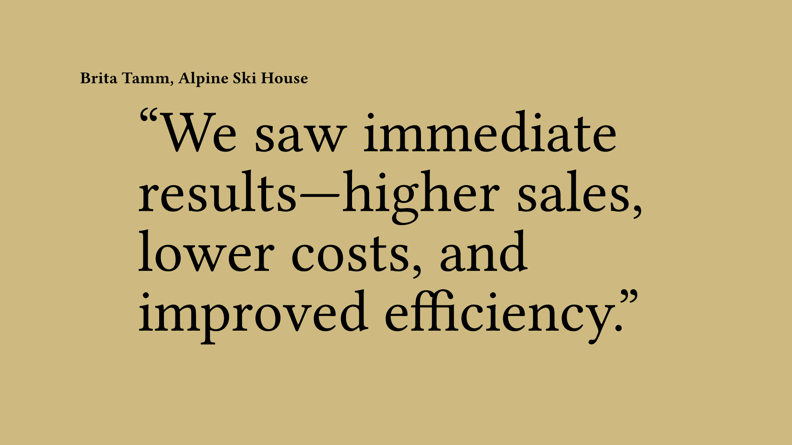 | 20.09% |
| 14 | 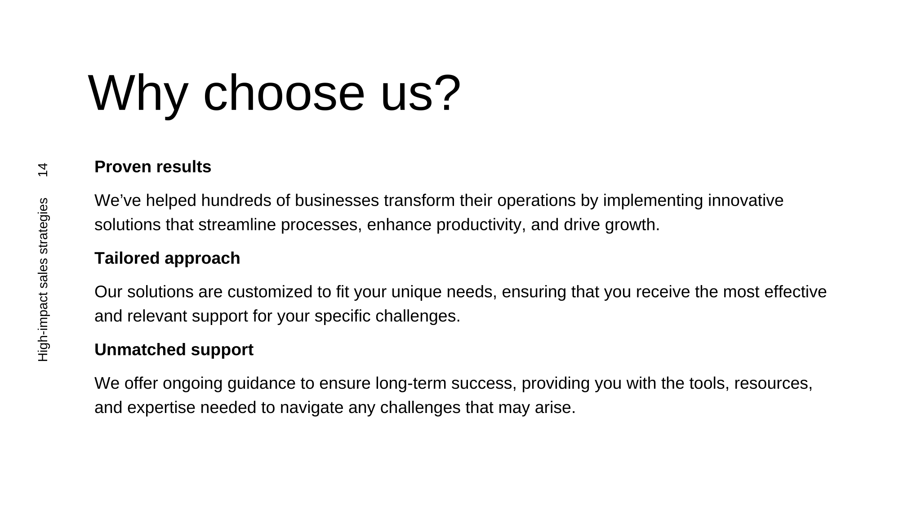 | 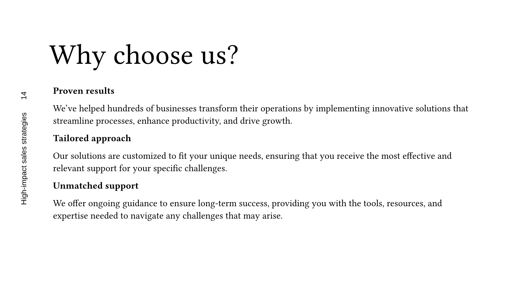 | 23.10% |
| 15 |  |  | 25.66% |
| 16 |  | 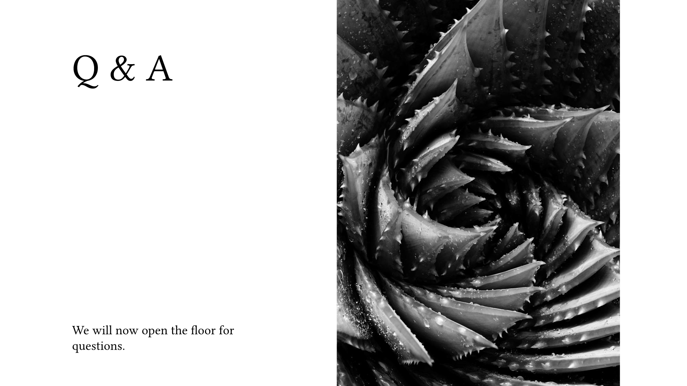 | 8.11% |

## Notes and observations

- The generated slides reproduce the overall structure and content of the reference PDFs, but visible differences are expected because PowerPoint and Typst use different text layout engines and font rasterizers.
- Differences are larger on slides with complex layouts, embedded images, or non-standard fonts.
- `pres-pro.pptx` shows a relatively high average RMSE, reflecting its varied and visually dense slides.
- These metrics are intended as a coarse regression signal, not a pixel-perfect pass/fail criterion.

## How to regenerate

Run from the repository root. Generate PNG slides from a PPTX file:

```bash
dotnet run --project tools/convert-pptx -- \
  examples/REF/PPTX/pres-pro.pptx \
  examples/output/pptx-comparison/generated/pres-pro \
  --format png \
  --font-path /usr/share/fonts
```

Rasterize the reference PDF to PNGs at 150 DPI (requires poppler):

```bash
pdftocairo -png -r 150 \
  examples/REF/PPTX/pres-pro.pdf \
  examples/output/pptx-comparison/official/pres-pro/page
```

### Recompute the RMSE table

With ImageMagick installed, the visual-diff tool's PNG-pair mode recomputes
per-slide RMSE without needing poppler (the committed official PNGs under
`docs/assets/pptx-comparison/official/` are reused as the reference):

```bash
dotnet run --project tools/visual-diff -- \
  --ref docs/assets/pptx-comparison/official/pres-pro \
  --gen examples/output/pptx-comparison/generated/pres-pro \
  --out examples/output/visual-diff/pptx-comparison/pres-pro \
  --name pres-pro
```

Per-slide `PercentRmse` values in `examples/output/visual-diff/pptx-comparison/pres-pro/metrics.json`
map 1:1 to the RMSE % column above. RMSE values are machine-dependent (fonts,
rendering backend), so expect small drift from the committed numbers; see
`tools/visual-diff/baselines/README.md`.
